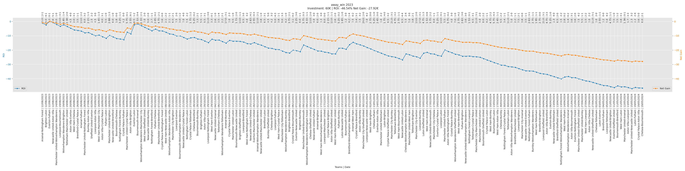

## [Home](https://nickpadd.github.io/EFLP.github.io/Home/ "EuropeanFootballLeaguePredictor Home page") | [The Model](https://nickpadd.github.io/EFLP.github.io/Model/ "Learn more about the model") | [Model Evaluation](https://nickpadd.github.io/EFLP.github.io/Evaluation/leagues/EPL "Past season performance of the model") | [Evaluation Matches](https://nickpadd.github.io/EFLP.github.io/Upcoming/leagues/EPL/ "The predictions of the upcoming matches") 

## [EPL](https://nickpadd.github.io/EFLP.github.io/Evaluation/leagues/EPL/ "Predictions for EPL") | [Bundesliga](https://nickpadd.github.io/EFLP.github.io/Evaluation/leagues/Bundesliga/ "Predictions for Bundesliga") | [La_Liga](https://nickpadd.github.io/EFLP.github.io/Evaluation/leagues/La_Liga/ "Predictions for La_Liga") | [Serie_A](https://nickpadd.github.io/EFLP.github.io/Evaluation/leagues/Serie_A/ "Predictions for Serie_A") | [Ligue_1](https://nickpadd.github.io/EFLP.github.io/Evaluation/leagues/Ligue_1/ "Predictions for Ligue_1")

The main betting points performance of the model with the configuration of {Regressor: Poisson Regressor, LongTermFormVote/ShortTermFormVote: 0.6/0.4, kelly_cap: 0.05, LongTermFormMonths/ShortTermFormMonths: Season, 3 Months} this year can be tracked with the below figures. The ROI indicator is the most indicative as it represents the percentage of the :

### Home Win Bet Performance

### Away Win Bet Performance

### Draw Bet Performance

### Over 2.5 Bet Performance

### Under 2.5 Bet Performance

